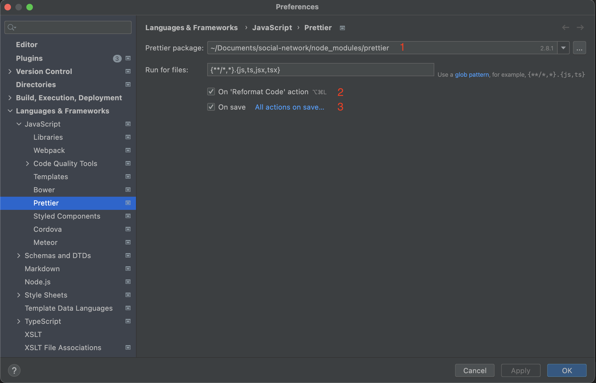

# General Notes

React project config set up for: **Create React App + TypeScript + ESLint + Prettier + WebStorm** from scratch.

Recommend to use **Yarn** as a package manager.

## Installation

1. To install [Create React App](https://create-react-app.dev/docs/getting-started#yarn) select a start directory for a new project and enter the following command:

```console
  yarn create react-app your-app-name --template typescript
```

Change the `your-app-name` to desired project name and note that we are using **TypeScript** as our template language.

2. To install [ESLint](https://yarnpkg.com/package/eslint) open the root project directory and enter the following command:

```console
  yarn add -D eslint
```

Note that we are using `-D` flag to install the package in `devDependencies`.

3. After installing **ESLint** we need to initialize the configuration file. To do this, enter the following command:

```console
  npx eslint --init
```

And answer the next questions:

```console
    How would you like to use ESLint? …
    To check syntax only
    ▸ To check syntax and find problems
    To check syntax, find problems, and enforce code style
```

```console
    What type of modules does your project use? … 
    ▸ JavaScript modules (import/export)
    CommonJS (require/exports)
    None of these
```

```console
    Which framework does your project use? …
    ▸ React
    Vue.js
    None of these
```

```console
    Does your project use TypeScript? 
    ‣ Yes / No
```

```console
    Where does your code run? …  (Press <space> to select, <a> to toggle all, <i> to invert selection)
    ✔ Browser
    ✔ Node
```

```console
    What format do you want your config file to be in? … 
    JavaScript
    YAML
    ▸ JSON
```

```console
    The config that you've selected requires the following dependencies:
    eslint-plugin-react@latest @typescript-eslint/eslint-plugin@latest @typescript-eslint/parser@latest
    ? Would you like to install them now with npm? ‣ No / Yes
```

4. Since we chose **No** for the last questions (we use **Yarn**), we need to install the suggested dependencies: 

```console
  yarn add -D eslint-plugin-react@latest @typescript-eslint/eslint-plugin@latest @typescript-eslint/parser@latest
```

5. To install **TypeScript plugins** related to ESLint enter the following command:

```console
    yarn add -D eslint-plugin-import @typescript-eslint/parser eslint-import-resolver-typescript
```

6. To install [Prettier](https://yarnpkg.com/package/prettier) enter the following command:

```console
    yarn add -D prettier eslint-config-prettier eslint-plugin-prettier eslint-plugin-react-hooks
```

7. To install [Prettier plugin sort imports](https://yarnpkg.com/package/@trivago/prettier-plugin-sort-imports) enter the following command:

```console
    yarn add @trivago/prettier-plugin-sort-imports
```

8. Create `.prettierrc` file in the root directory and fill the rules. See example [here](.prettierrc)

9. Create `.prettierignore` file in the root directory and fill the rules. See example [here](.prettierignore)

10. Fill the `.eslintrc.json` file as in example [here](.eslintrc.json). ❗ Note that the order in which the "extends" object keys are placed is important. 

11. Create `.eslintignore` file in the root directory and fill the rules. See example  [here](.eslintignore)
 
12. Fill the `tsconfig.json` file as in example [here](tsconfig.json)

13. Create a `.env` file in the root directory. You can add a row like `PORT=3002` to the `.env` file, and run the project on the desired port. ❗ Note that we need to put `.env` file inside `.gitignore`in order to exclude data sharing from it.

14. To install `Prettier` plugin to **WebStorm** open the Webstorm > Preferences > Plugins, find **Prettier** and install it.

15. To run `Prettier` automatically against specific files, open the Webstorm > Preferences > Languages & Frameworks > JavaScript > Prettier, select the right path to Prettier package, and use the "On reformatting code" and "On save" checkboxes to specify the actions that will trigger Prettier.



## Project structure

The project structure should look like this:
